# Palo Alto Firewall — App-ID Deep Dive Lab

A hands-on home lab demonstrating **zone-based firewall design, NAT, and Layer 7 Application Identification (App-ID)** on a Palo Alto Networks PA-VM firewall, built and tested in a fully virtualized environment.

The centerpiece of this lab is a live demonstration of **App-ID's continuous, mid-session traffic reclassification** — proving that PAN-OS enforces policy based on the *actual application*, not just the port/protocol that a session was opened on.

---

## Table of Contents

- [Objective](#objective)
- [Lab Environment](#lab-environment)
- [Network Topology](#network-topology)
- [Configuration Walkthrough](#configuration-walkthrough)
  - [1. Zones](#1-zones)
  - [2. Interfaces](#2-interfaces)
  - [3. DMZ Server Build (Apache2 + BIND9)](#3-dmz-server-build-apache2--bind9)
  - [4. NAT Policy](#4-nat-policy)
  - [5. Security Policy](#5-security-policy)
- [Testing & Verification](#testing--verification)
- [Key Takeaway — Why App-ID Matters](#key-takeaway--why-app-id-matters)
- [Skills Demonstrated](#skills-demonstrated)
- [Repository Structure](#repository-structure)
- [About Me](#about-me)

---

## Objective

Most firewalls filter traffic by IP, port, and protocol. Palo Alto's **App-ID** engine instead identifies the actual application riding on a session — regardless of port — and can revoke a session mid-flow the moment it positively identifies an application that policy doesn't permit.

This lab builds a small but complete three-zone network (Inside / DMZ / Outside), configures NAT and security policy from scratch, and then proves App-ID's behavior with a real, reproducible test: browsing to `google.com` is blocked by App-ID (`google-base`) even though generic `ssl`/`web-browsing` traffic on port 443 is explicitly allowed by the same rule.

## Lab Environment

| Component | Detail |
|---|---|
| Host OS | Windows 11 |
| Virtualization | VMware Workstation |
| Network Emulation | EVE-NG |
| Firewall | Palo Alto PA-VM (PAN-OS 10.1.0) |
| DMZ Server | Ubuntu Linux — Apache2 (web) + BIND9 (DNS) |
| Clients | Windows VMs (Inside client, Outside client) |

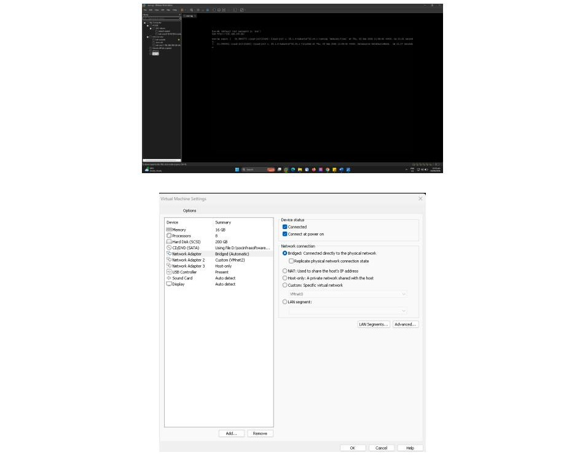

The virtual network adapter (`vmnet2`) was configured with a dedicated DHCP scope to support the emulated topology:

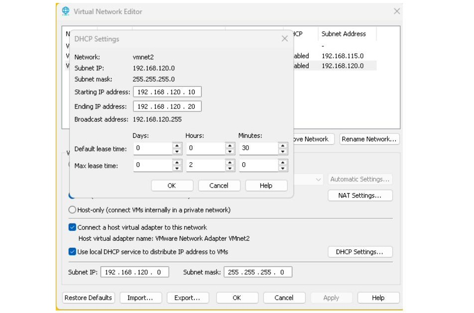

## Network Topology

Three security zones were defined on the PA-VM: **Inside**, **DMZ**, and **Outside**.

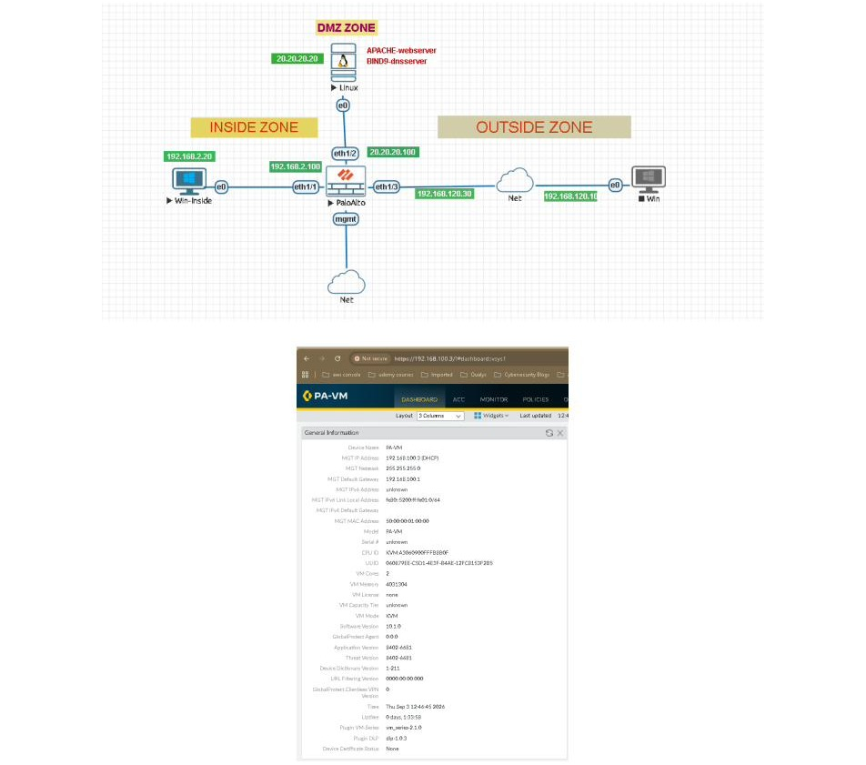

| Zone | Host | IP Address | Firewall Interface |
|---|---|---|---|
| Inside | Win-Inside (client) | `192.168.2.20/24` | `eth1/1` — `192.168.2.100` |
| DMZ | Ubuntu (Apache2 + BIND9) | `20.20.20.20/24` | `eth1/2` — `20.20.20.100` |
| Outside | Win (remote client) | `192.168.120.10/24` | `eth1/3` — `192.168.120.30` |

A dedicated management network connects to the firewall's `mgmt` interface for the PAN-OS web UI and CLI.

## Configuration Walkthrough

### 1. Zones

Layer 3 security zones (`Inside`, `Outside`, `DMZ`) were created under **Network > Zones**, each bound to its respective interface and left at default User-ID / Device-ID settings for this lab scope.

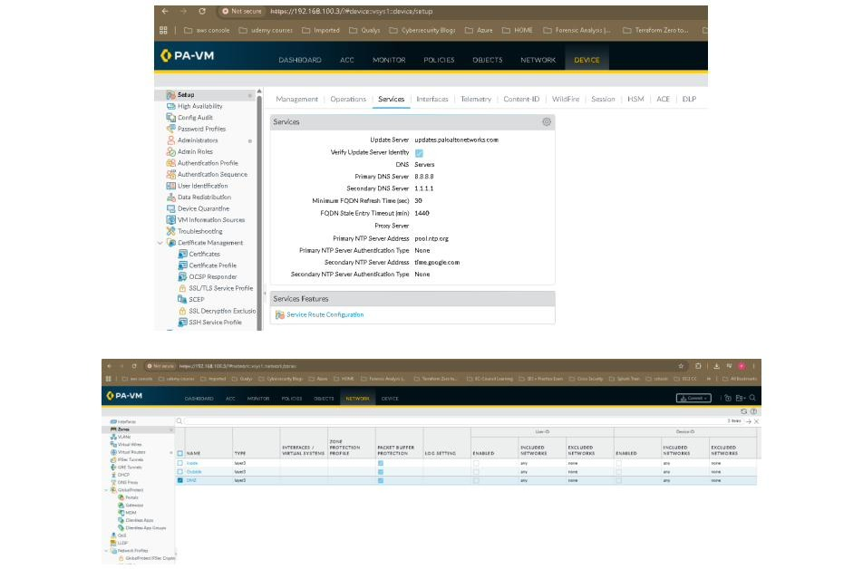

### 2. Interfaces

All three data interfaces were configured as Layer 3 with static IPs bound to their zones, then validated with connectivity tests from each segment.

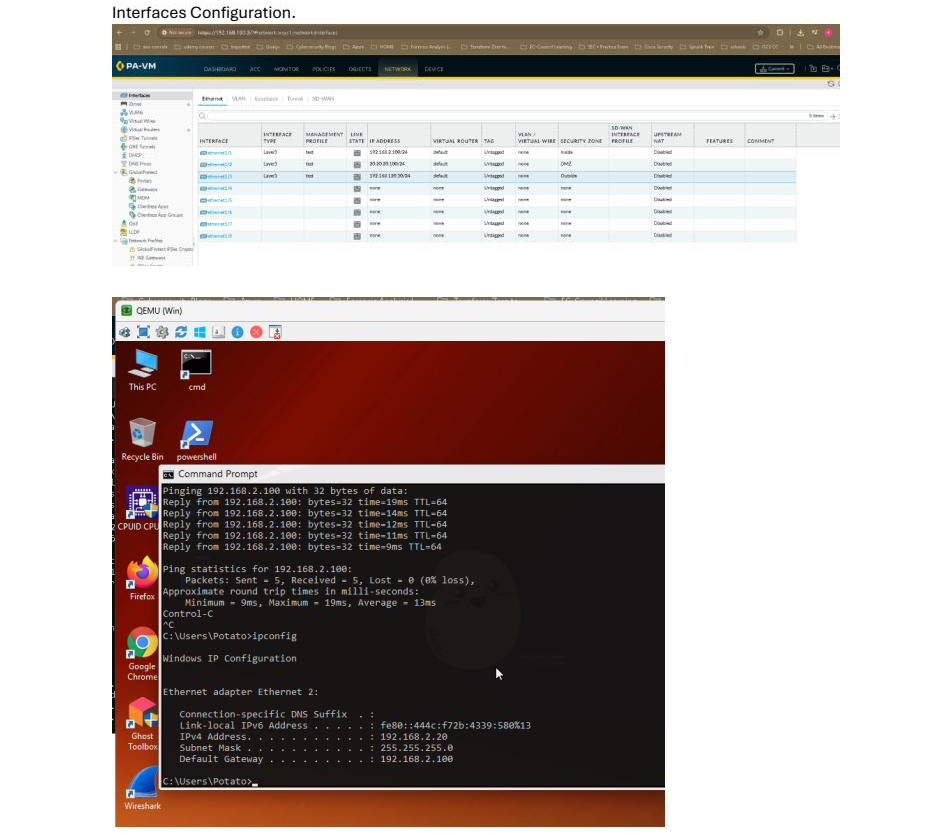

**DMZ interface validation** — from the Ubuntu server, `ip a` confirms the `20.20.20.20/24` address on `ens3`, and a ping to the DMZ gateway (`20.20.20.100`) confirms Layer 3 reachability to the firewall:

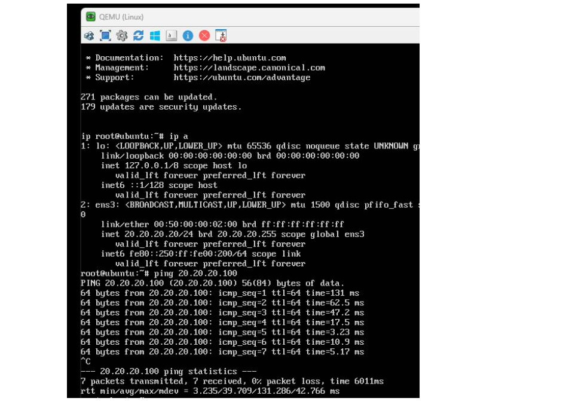

**Outside interface validation** — from the remote Windows client, `ipconfig` confirms `192.168.120.10/24`, and a continuous ping to the firewall's outside interface (`192.168.120.30`) confirms reachability:

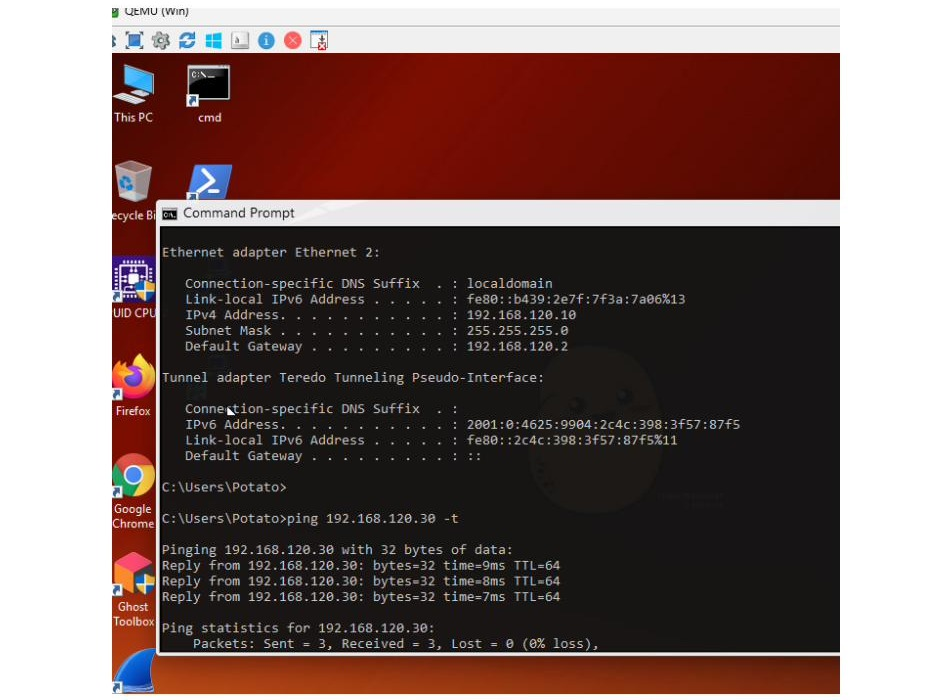

### 3. DMZ Server Build (Apache2 + BIND9)

The DMZ host runs Ubuntu Server with:
- **Apache2** — serving the default landing page, used as the target web application for all App-ID and security-policy tests.
- **BIND9** — providing authoritative DNS resolution for the lab domain, used to validate the `dns` App-ID and the Mgmt-Ping-DNS policy.

This mirrors a typical hardened DMZ pattern: a public-facing service isolated in its own zone, reachable only through explicit NAT and security policy rules — never directly exposed.

### 4. NAT Policy

Two NAT rules were built to cover both directions of traffic:

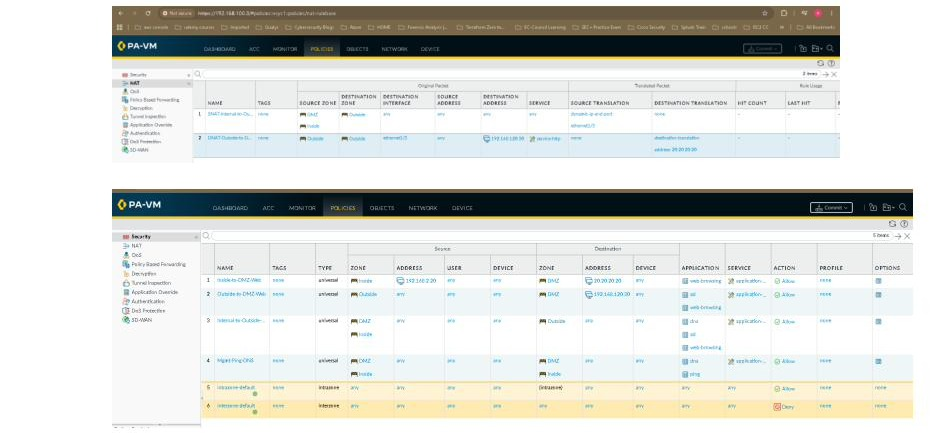

| # | Rule Name | Type | Source Zone | Destination | Translation |
|---|---|---|---|---|---|
| 1 | `SNAT-Internal-to-Outside` | Source NAT | DMZ, Inside → Outside | any | **Dynamic IP and Port (PAT)** — internal/DMZ hosts share the firewall's `eth1/3` outside address for outbound sessions |
| 2 | `DNAT-Outside-to-DMZ-Web` | Destination NAT | Outside → Outside (`eth1/3`, `192.168.120.30`) | web service | **Static destination translation** to `20.20.20.20` — publishes the internal Apache server to the outside network without exposing its real IP |

**How it works:**
- **SNAT (source NAT / PAT)** rewrites the source IP:port of outbound sessions to the firewall's own outside interface address, so DMZ and Inside hosts can reach the Internet using a single public-facing IP — the reverse mapping is tracked per-session in the NAT/session table so return traffic is translated back correctly.
- **DNAT (destination NAT)** rewrites the destination IP of inbound sessions arriving on the outside interface, transparently redirecting them to the real internal server (`20.20.20.20`). This is the standard way to "publish" an internal service without ever routing external traffic directly to the DMZ subnet.

### 5. Security Policy

Traffic is default-deny; only what's explicitly permitted crosses zones.

| # | Rule Name | Source Zone | Destination Zone | Application(s) | Action |
|---|---|---|---|---|---|
| 1 | `Inside-to-DMZ-Web` | Inside (`192.168.2.20`) | DMZ (`20.20.20.20`) | `web-browsing` | Allow |
| 2 | `Outside-to-DMZ-Web` | Outside | DMZ (`192.168.120.30`, NAT'd) | `web-browsing` | Allow |
| 3 | `Internal-to-Outside-Web` | Inside | Outside | `dns`, `ssl`, `web-browsing` | Allow |
| 4 | `Mgmt-Ping-DNS` | DMZ, Inside | DMZ, Inside | `dns`, `ping` | Allow |
| 5 | `intrazone-default` | any | (intrazone) | any | Allow *(implicit)* |
| 6 | `interzone-default` | any | any | any | **Deny** *(implicit)* |

Each rule is scoped to the minimum App-ID set required for its purpose rather than "any application" — this is what makes the App-ID test below possible: rule 3 permits `ssl`, `dns`, and `web-browsing`, but nothing broader.

## Testing & Verification

**1. Inside → DMZ Web.** Browsing from the Inside client to the Apache server at `20.20.20.20` succeeds, matched and logged against the `Inside-to-DMZ-Web` rule (`Monitor > Traffic`, App-ID = `web-browsing`, Action = allow).

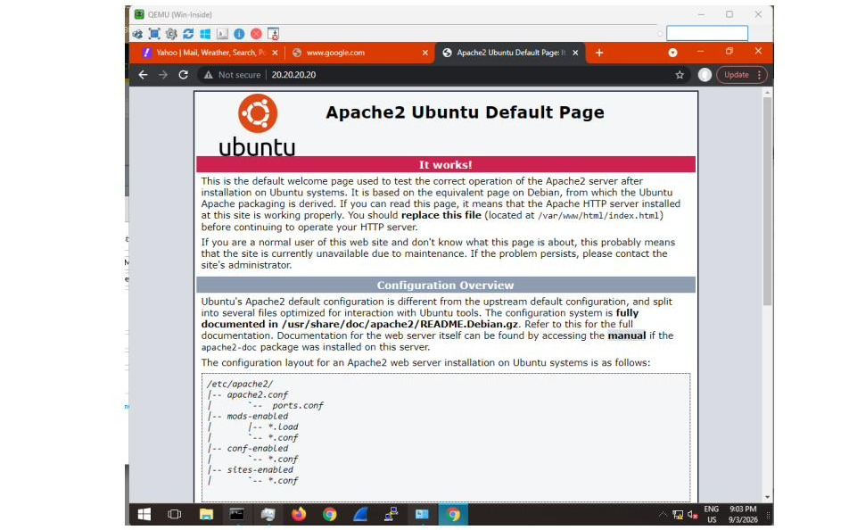

**2. Outside → DMZ Web (via DNAT).** Browsing to `http://192.168.120.30` — the firewall's *published* outside address — returns the same Apache page. The detailed traffic log confirms the session hit `DNAT-Outside-to-DMZ-Web`, transparently redirecting the request to the real server at `20.20.20.20`.

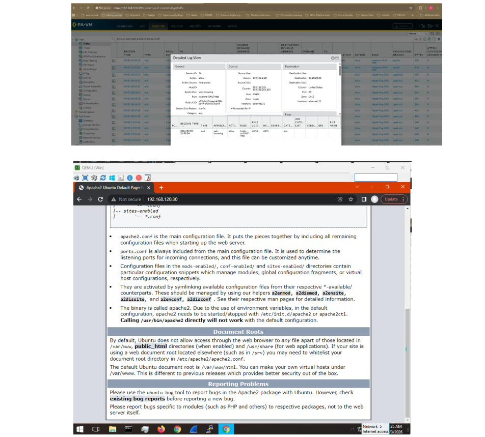

**3. Internal → Outside Web (SSL).** Browsing from Inside to `https://yahoo.com` succeeds. `Monitor > Traffic` shows the session matched to `Internal-to-Outside-Web`.

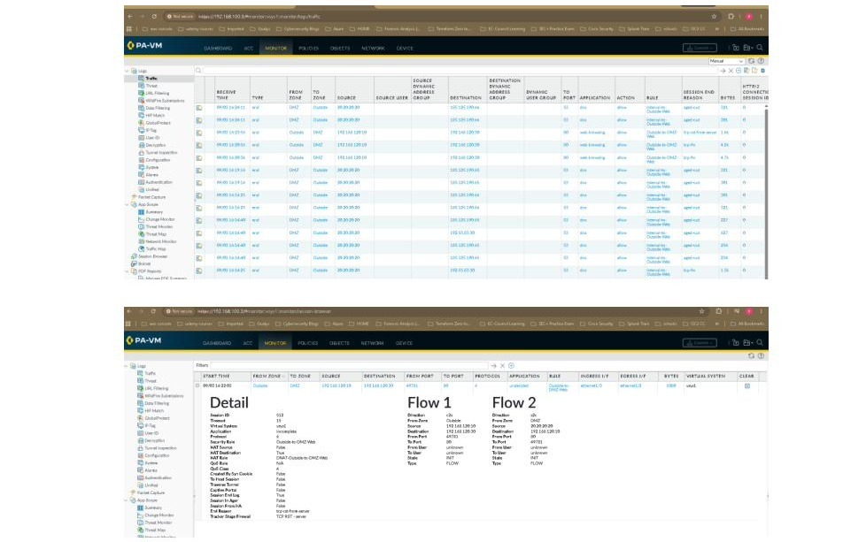

**4. App-ID enforcement — the key test.** With the exact same rule (`Internal-to-Outside-Web`, permitting `ssl`/`web-browsing`/`dns` on port 443/80/53), browsing to `https://www.google.com` fails with `ERR_CONNECTION_RESET`:

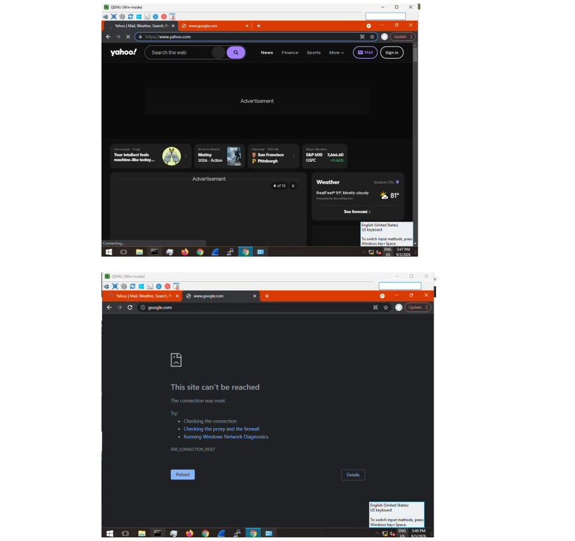

**5. CLI verification.** `show session all filter source 192.168.2.20` on the PAN-OS CLI shows the mechanism directly: sessions identified as generic `ssl` remain `ACTIVE`, while sessions that Content-ID reclassified as the `google-base` App-ID are marked `DISCARD` — confirming the firewall terminated those sessions mid-flow once the true application was identified, because `google-base` was never explicitly permitted.

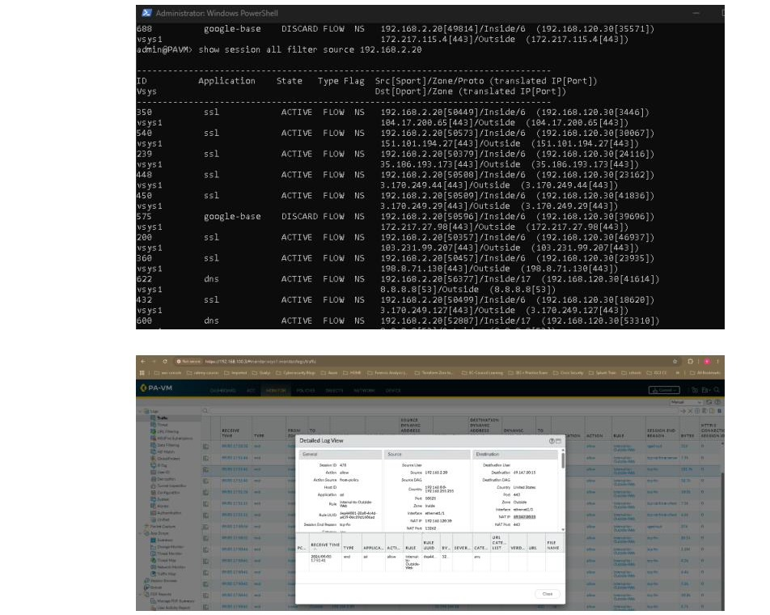

**6. Mgmt-Ping-DNS validation.** `nslookup google.com 20.20.20.20` resolves successfully against the DMZ BIND9 server, and ICMP pings between Inside and DMZ succeed — both matched to the `Mgmt-Ping-DNS` rule.

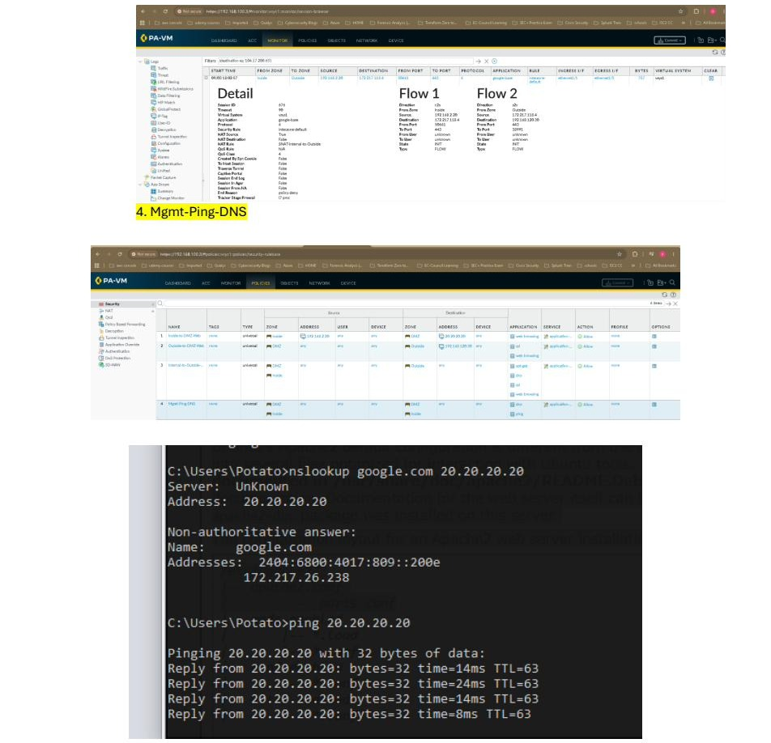

**7. Full traffic log summary.** The combined `Monitor > Traffic` view ties every test back to its matching rule, application, and action — a clean audit trail of the entire policy set in action.

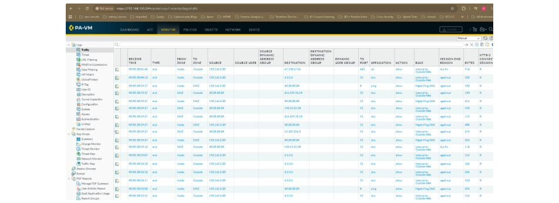

## Key Takeaway — Why App-ID Matters

Traditional port-based firewalls would have allowed the `google.com` session outright — it's HTTPS on port 443, same as Yahoo. Palo Alto's App-ID engine instead **keeps inspecting a session throughout its life**, not just at setup. The moment enough packets arrive for Content-ID to positively identify the true application (`google-base`, a specific signature distinct from generic `ssl`/`web-browsing`), PAN-OS re-checks that identity against policy — and since `google-base` was never explicitly permitted, the session is discarded mid-flow, even though it opened cleanly under a rule that *looked* broad enough to allow it.

This is the practical difference between "filtering by port" and "filtering by application," and it's the core value proposition of next-generation firewalls in a modern security stack.

## Skills Demonstrated

- **Firewall architecture** — zone-based segmentation (Inside / DMZ / Outside), least-privilege security policy design
- **Palo Alto PAN-OS administration** — zones, Layer 3 interfaces, NAT (source & destination), security policy rule base
- **NAT engineering** — dynamic IP/port (PAT) for outbound access, static destination NAT for publishing internal services
- **Application Identification (App-ID) & Content-ID** — understanding and demonstrating signature-based, session-persistent application classification
- **Traffic analysis & troubleshooting** — using `Monitor > Traffic`/detailed log views and the PAN-OS CLI (`show session all filter ...`) to verify policy behavior and root-cause a blocked connection
- **Linux server administration** — deploying and validating Apache2 (web) and BIND9 (DNS) services
- **Network virtualization** — building a multi-VM lab topology with VMware Workstation and EVE-NG
- **Documentation** — structuring and communicating a technical lab clearly for review by peers and hiring managers

## Repository Structure

```
palo-alto-app-id-lab/
├── README.md
└── screenshots/
    ├── 01-lab-environment-setup.jpeg
    ├── 02-vmware-dhcp-settings.jpeg
    ├── 03-network-diagram.jpeg
    ├── 04-zones-configuration.jpeg
    ├── 05-interfaces-configuration.jpeg
    ├── 06-dmz-configuration.jpeg
    ├── 07-outside-configuration.jpeg
    ├── 08-nat-and-security-policy.jpeg
    ├── 09-test-inside-to-dmz-web.jpeg
    ├── 10-test-outside-to-dmz-web.jpeg
    ├── 11-test-internal-to-outside-web.jpeg
    ├── 12-appid-blocks-google-base.jpeg
    ├── 13-cli-session-verification.jpeg
    ├── 14-mgmt-ping-dns-test.jpeg
    └── 15-traffic-log-summary.jpeg
```

## About Me

IT professional transitioning into cybersecurity, with hands-on lab experience in next-generation firewall administration, network segmentation, and traffic analysis. This repository is part of a growing portfolio built to demonstrate practical, verifiable skills — feel free to reach out with questions or feedback.
